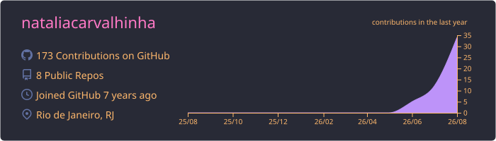
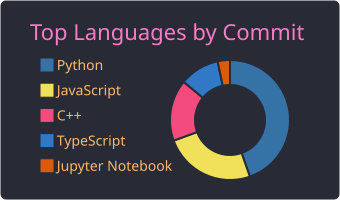
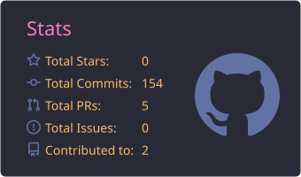

# Hi, I'm Natalia Carvalhinha 👋

I'm an **Electronics and Computer Engineering student** interested in **software engineering, system architecture, and electronics**.

I enjoy building and improving real-world systems, with a focus on **maintainable software, backend development, and system integration**.

### 🛠️ Tech Stack

  

### 📊 GitHub Statistics

  

  
  

### 📫 Contact

  
  

